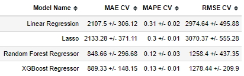

## ROSSMANN SALES PREDICTION
Sales projection for a retail chain for the next 6 weeks.

 

## 01. BUSINESS

Rossmann operates over 3,000 drug stores in 7 European countries. Currently, Rossmann store managers are tasked with predicting their daily sales for up to six weeks in advance. Store sales are influenced by many factors, including promotions, competition, school and state holidays, seasonality, and locality. With thousands of individual managers predicting sales based on their unique circumstances, the accuracy of results can be quite varied.

The task is to forecast the "Sales" column for the test set for the next 6 weeks.

## 02. DATA OVERVIEW

The data was collected from [Kaggle](https://www.kaggle.com/competitions/rossmann-store-sales/data). The initial features descriptions are available below and contains sales data for 1,115 Rossmann store:

| Feature | Definition |
|---|---|
| Id | an Id that represents a (Store, Date) duple within the dataset.|
| Store | a unique Id for each store.|
| Sales | the turnover for any given day.|
| DayOfWeek | day of week on which the sale was made (e.g. DayOfWeek=1 -> monday, DayOfWeek=2 -> tuesday, etc).|
| Date | date on which the sale was made.|
| Customers | the number of customers on a given day.|
| Open | an indicator for whether the store was open: 0 = closed, 1 = open.|
| StateHoliday | indicates a state holiday. Normally all stores, with few exceptions, are closed on state holidays. Note that all schools are closed on public holidays and weekends. a = public holiday, b = Easter holiday, c = Christmas, 0 = None.|
| SchoolHoliday  | indicates if the (Store, Date) was affected by the closure of public schools.|
| StoreType  | differentiates between 4 different store models: a, b, c, d.|
| Assortment | describes an assortment level: a = basic, b = extra, c = extended.|
| CompetitionDistance | distance in meters to the nearest competitor store.|
| CompetitionOpenSince(Month/Year)| gives the approximate year and month of the time the nearest competitor was opened.|
| Promo | indicates whether a store is running a promo on that day.|
| Promo2 | Promo2 is a continuing and consecutive promotion for some stores: 0 = store is not participating, 1 = store is participating.|
| Promo2Since(Year/Week)| describes the year and calendar week when the store started participating in Promo2.|
| PromoInterval | describes the consecutive intervals Promo2 is started, naming the months the promotion is started anew. E.g. "Feb,May,Aug,Nov" means each round starts in February, May, August, November of any given year for that store.|

## 03 BUSINESS ASSUMPTIONS

- Stores marked as opened and with no sales were removed from the analyzes.

- Stores marked as closed were removed from the analyzes

- Stores with no distance information from competitors were considered at a distance of about 3 times the maximum distance from the dataset to simulate the absence of competitors.

## 04 SOLUTION STRATEGY

The strategy adopted was the following:

- STEP 01 - **_Data description :_** Renaming columns, checking data types, searching for missing values and preliminary statistical description.

- STEP 02 -  **_Feature Engineering :_**  Understanding how the business works by creating a mind map and derivate some new features from the original ones .

- STEP 03 - **_Data filtering :_** Data containing inputs which does not match to the scope of the project were removed.

- STEP 04 -  **_Exploratory Data Analysis :_** Exploring the data in order to answer the main questions indicated in the hypothesis map, by analyzing the data on univariate, bivariate and multivariate analysis. Look for useful business insights and find important features for the ML model.

- STEP 05 - **_Data preparation :_** Applying normalization and rescaling techniques in the data, as well as encoding methods and response variable transformation. These crucial steps aim to prepare data for machine learning models.

- STEP 06 - **_Feature Selection :_** Verifying which feature is important to input to the ML model. In this project the best features were selected by applying the Boruta algorithm.

- STEP 07 - **_Machine learning modelling :_**
Training and predicting results with ML algorithms. Cross-validation were used to assess the best performance model. The best model was selected to be improved via hyperparameter fine tuning.

- STEP 08 - **_Model to business :_** Translating the results to financial and business performance.

- STEP 09 - **_Deploy model to production :_** Deploying the model to be reachable to all retail chain managers.

## 05 DATA INSIGHTS

- The average sales of the 'extra' assortment is higher than the other assortments, but represents only 1% of the total number of stores. On the other hand, the 'basic' assortment is the most representative assortment type (53%), but it has the worst performance (average sales).

- Stores with 'extended' promo (promo2) doesn't have a better performance comparing with 'regular' promo.

- Stores with closest competitors are not impacted negatively. It may indicates there is no direct competitors fighting for the same customers in the same area.

## 05 MACHINE LEARNING MODELS

The following 4 machine learning algorithms were used to predict sales/

- Linear Regression
- Lasso Regression (Regularized Linear Regression)
- Random Forest Regressor
- XGBoost Regressor

Every model were cross-validated and its performance were compared.

## 06 MACHINE MODEL PERFORMANCE

The performance cross-validated for all 4 algorithms are displayed below:

 

 Taking into account both Linear Redression and Lasso Regression, we can conclude that dataset has a non-linear behavior, hence the use of more complex models, such as Random Forest Regressor and XGBoost Regressor.
The XGBoost Regressor model was chosen for the hyperparameter tuning. Although it has an average RMSE result similar to the Random Forest Regressor model, the XGBoost Regressor model has the smallest dispersion in the set of RMSE results. 

 After tuning  hyperparameters using Random Search the model performance has improved (results for the same set of training/validation data): 

| Model | MAE | MAPE | RMSE
| --------- | ---------- | ----------- | -----------
|XGBoost Regressor before tuning hyperparameters	| 760.41 | 0.1141 | 1095.86|
|XGBoost Regressor after tuning hyperparameters	| 733.91 | 0.1106 | 1055.99|

## 07 MODEL DEPLOYEMENT

  Deploying this model to production, the managers will be informed with an accurated prediction of sales in 6 weeks window. The predictions per store can be consulted by using the Telegram Bot.
This application, the user must send in Telegram Bot the <b> "store_number" (e.g. 22, 26, 80, etc) </b>, from which he wants to get the sales prediction for the next 6 weeks. Thus, the bot will return a message with the prediction. If a store number is non existent the message "Store Not Available" will be returned, and if you provide a text that isn't a number the bot will ask you to enter a valid store id.

To link to chat with the Rossmann Bot is 

<i> Note: It can take a few minutes for the bot to respond, <b> on the first request. </b> </i>

## 08 CONCLUSIONS

 The problem presented by Rossmann was solved with the model developed in this project. With this model, Rossmann's managers will have the sales prediction for the next 6 weeks per store, as well as the total amount. 

 With these projection, Rossmann managers will be able to plan the allocation of resources that will be generated in the next 6 weeks with great accuracy.

## 09 NEXT STEPS

 By analyzing the residuals of the final model, it is important to indicate that the solution could be improved by a few strategies: 

- predicting the amount of costumers over the next six weeks, so that the costumers feature could be added to the ML model.

- tuning the ML algorithm by applying a Bayesian search instead random search.

- trying other ML models

These methods can be used on the next CRISP cycle in this project.

### Contact

- smbaptistag@gmail.com

- 
